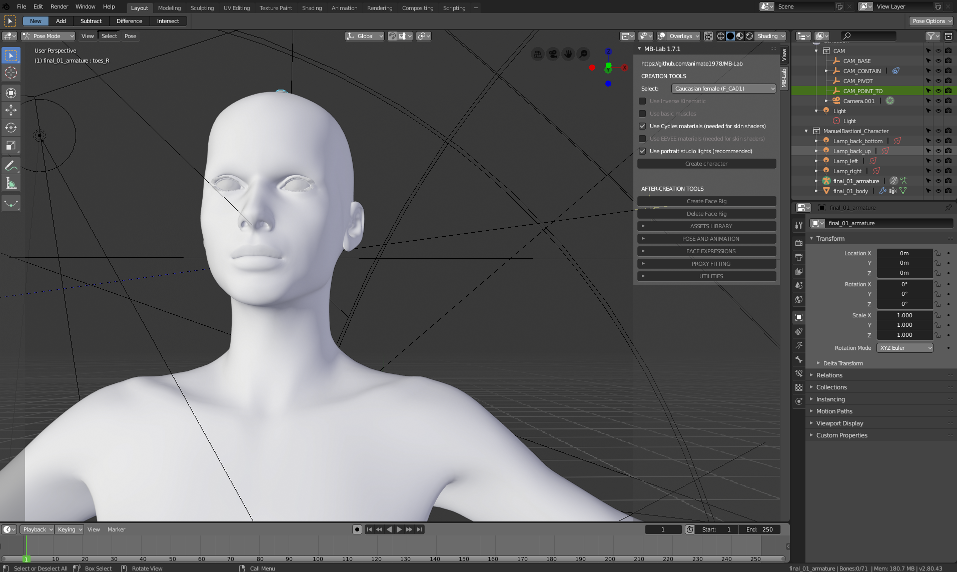

After Creation Tools ===================

After the modeling of your character has been finalized MB-Lab will go
back to it's default UI panel.

This is the time when your character is done and you can do with it as
you wish, either further editing it by sculpting, or adding clothes,
defining poses or starting animation sequences, or none at all and this
is your character ready for it's next task.

face\_rig

