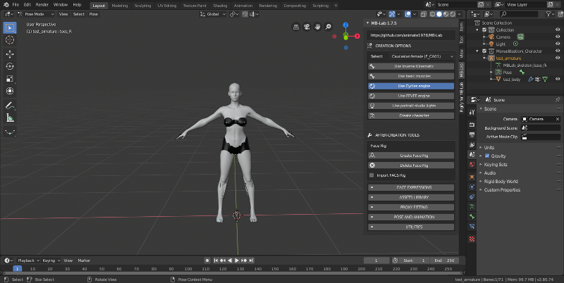

After Creation Tools
===================

After the modeling of your character has been finalized MB-Lab will go back to it's default UI panel.

The After Creation Tools area contains functions that could help with characters post creation, such as poses, animations and adding clothing.

* Face Expressions
* Add clothing or hair assets
* Fit the assets to your character
* Poses
* Animation
* Helper tools

It should be noted that these functions are possible using default Blender tools as well, these functions are helpers or automated parts that are not perfect and in some cases contains buggy code.

Some of these functions are experimental as well and may evolve or be dropped in favor of better methods, tools or code.

