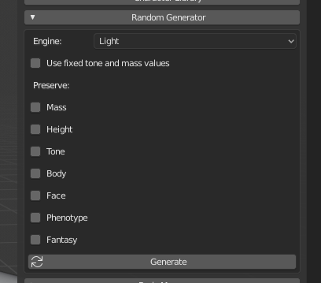
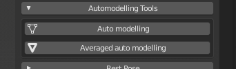
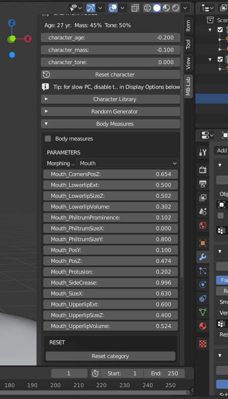

Creation Tools
==============

After the character creation, a human model with basic proportions is placed in the center of the Blender scene and MB-Lab panel will show a series of tools to modify it.

There are six ways to manipulate the character:

* Using the meta parameters: body mass, body tone and age
* Loading a preset from the character library: types, specialtypes and phenotypes.
* Using the quasi-random generator.
* Using the automodelling tool.
* Modifying the "low level" parameters: nose, eyes, mouth, legs, etc.
* Using the measure tool.

===============
Meta parameters
===============

The metaparameters are the most intuitive way to define a character. Using this technology, the definition of the main traits of the character is matter of few seconds. The user interface is very easy to understand: just three intuitive sliders for the values of age, mass and tone.

.. image:: images/metaparam_01.png

* The age can vary from 18 to 80 y.o.
* The mass can vary from 0% to 100%.
* The tone can very from 0% to 100%

The percentage used for tone and mass indicates the variation of these parameters from a minimal amount (0%) to a max amount (100%). So 0% of mass is not intended as a character with no mass, but as a character with the minimal amount of mass required to live.

.. image:: images/gallery_140_14.png

.. image:: images/gallery_140_15.png

The height is not one of the meta parameters, because it's handled separately in the Measure system

Behind these three operators there is a complex algorithm that evaluates in real time tens of body features, using a non-linear computation to simulate the shape of human body in different conditions. As example, the image below shows the overview of the non-linear function used to calculate the effect of the age from 18 to 80 y.o.

The effect of meta parameters is very easy to predict: increasing the mass will lead to an increment of the body volume, but the "quality" of this mass depends by the tone. Of course, both "tone" and "mass" levels are affected by the age.

==============
Preset library
==============

Another way to quickly define a character is loading the parameters directly from the preset library

A "type" defines in one shot all the main features of the body: bone structure, fat percentage, mass and muscles. Each type is created upon anthropometric data and artistic observations and delineates the body of the character. Types are labelled using simple names, like "ideal fashion", "athletic", "lazy", "hourglass".

.. image:: images/modeltypes_01.png

The system uses this kind of identifiers because they are less difficult to remember and more intuitive than scientific terms utilized in anthropometry.

Types can be selected via the intuitive GUI in the main panel, it's also possible to use the "Mix" option to blend different types.

.. image:: images/mixtypes_03.png

A "special-type" differs from the "type" because it can describe non-realistic creatures (as example comic heroes, brute and other people with augmented proportions) or data-only entities (for example "older" and "younger" specialtypes).

Depending on the features that are modified and the way they are modified, types can be grouped into categories

* Types defined mainly by the variation of muscle and mass percentages
* Complex types defined by the variation of proportions, mass and muscles
* Types defined by basic shapes

Also the library includes the important database for ethnic phenotypes:

* Afro phenotypes
* Asian phenotypes
* Caucasian phenotypes

There are also types and phenotypes for anime characters

.. image:: images/anime_variations01.png

================
Random Generator
================

The other way to create characters is using the quasi-random generator, that it's not entirely random, but partially controlled by some parameters.

The engine includes some new algorithms, where the most interesting is probably the "phenotype" option, that automatically creates variations of character preserving the prevalent "dna" characteristics.

Another fundamental parameter is the scale of the randomization.

It goes from "Light" level to "Extreme" level, through five degrees of intensity.

Using the first two levels, the generated characters will be realistic and plausible in the range of human variations. using other parameters the results will tend to be unrealistic and grotesque.

Five characters created with the realistic engine

.. image:: images/generator02.png

Five characters created using the extreme engine

.. image:: images/generator03.png

The main feature that makes the quasi-random generator a very powerful modeling tool is that it can be used in combination with the other MB-Lab tools.

Other constrains are more intuitive: during the generation it's possible to preserve the mass, the muscles, the height and the face of the characters.

This is very useful, for example if you like the face of the random generated character, but not the body, you can constrain the face and generate new variations.

=============
Auto-Modeling
=============

The auto-modeling system is an innovative way to define the character starting from a 3D draft.

.. image:: images/automodelling02.png

The user quickly modifies the character to vaguely suggest what he has in mind and the system works on it, correcting the errors and creating a character that best fits the user input.

With this method, the artist can create his base character practically with two clicks.

The first button, "auto modeling" corrects the anomalies in order to convert the model in the corresponding realistic human; the button "smooth" normalizes the character, making it more "uniform" and smooth.

The system doesn't use math methods like PCA or SVD, but relies on the theory of proportions, that's more familiar to artists and already well studied by Renaissance geniuses as Leonardo Da Vinci and Piero Della Francesca.

The algorithm is optimized and doesn't require big system resources. Practically it analyzes the given proportions using some smart algorithms and then creates a coherent character that fits these proportions as close as possible.

"Coherent" means that the system can recognize, for example, if a big biceps circumference refers to a bodybuilder or to an overweight man so it doesn't return a character with the torso of a bodybuilder and the arms of an overweight man.

========
Measures
========

It's possible to define the shape of characters using a set of body measures. This new feature is available only for human characters (i.e. it's not available for anime).

By default, the measures are not enabled and the column shows only the anatomic details. The upper element is the selector for the morphing category.

A morphing category is a body element (for example the head) or a set of morphings (for example the expression units).

Enabling the measures editor, the GUI is divided in two main sections: the column of anatomical parameters and the column of dimensions. The second column is dedicated to measures: see this page for more information.

Depending on the category selected, the panel will show some sliders to increase or decrease a specific feature. In most of cases the parameters are very intuitive, for example increasing or decreasing the length of upper arm, but in some cases you need to try to see what happens, for example increasing or decreasing the dolichocefal value of the head.

The measures editor is enabled selecting the "Body measures" option.

.. image:: images/bodymeasures_02.png

When the measures editor is enabled, the "body parameters" panel contains two main sections: the column of anatomical parameters and the column of measures. The first column is dedicated to anatomical details: see this page for more information. The second column contains the main anthropometric measures used in design, anthropology and tailoring.

.. image:: images/bodymeasures_03.png

There is an option to use "Inches" rather than "Centimeters" as well, converting from one measurement system to another. This updates in realtime.

There are three methods to set the measures of body: direct, indirect and loading a measure file.

**Direct method**

The direct method lies in setting the values (in cm or inches) directly in the measure column. Pressing the "Automeasure" button the system will analyse the proportions and will return a coherent human that fits as close as possible all the given values. Comparing the measures with a database, the system can recognize, for example, if a big upperarm circumference is part of a bodybuilder or an overweight character and create a consistent model.

**Indirect method**

The indirect method lies in modifying the values of anatomical parameters, monitoring the changes in the measure column. It can be difficult, since each parameter usually affects many measures in the same time, but it can be a good way for little adjustements or for checking the dimensions of the character.

**Loading a measure file**

The system can also export and import the measures using the simple json format. This format is human readable, highly portable and simple to generate, so it can be easily adopted by external software to communicate with MB-Lab.

**Precision**

Due to this algorithm, the resulting measures can differ a bit from the user input. In particular if the given measures are unrealistic or very uncommon, the result can present noticeable differences. The precision of the method will increase release by release, proportionally to the growing of the lab database.

The height of the character can't be assigned directly, but is automatically calculated as sum of neck, torso, buttock, upper leg, lower leg and feet height.

**Reset**
The button "Reset category" resets all the sliders of the selected category, setting their value to 0.5.

===========
Model Types
===========

A "type" defines in one shot all the main features of the body: bone structure, fat percentage, mass and muscles. Each type is created upon anthropometric data and artistic observations and delineates the body of the character.

Types are labeled using simple names, like "ideal fashion", "athletic", "lazy", "hourglass".

.. image:: images/modeltypes_01.png

The system uses this kind of identifiers because they are less difficult to remember and more intuitive than scientific terms utilized in anthropometry.

Types can be selected via the intuitive GUI in the main panel, it's also possible to use the "Mix" option to blend different types.

.. image:: images/mixtypes_03.png

.. image:: images/gallery_140_28.png

A "special-type" differs from the "type" because it can describe non-realistic creatures (as example comic heroes, brute and other people with augmented proportions) or data-only entities (for example "older" and "younger" special types).

Depending on the features that are modified and the way they are modified, types can be grouped in some big categories:

* Types defined mainly by the variation of muscle and mass percentages
* Types defined mainly by the variation of proportions
* Types defined by basic shapes

Examples of types

.. image:: images/gallery_140_25.png

.. image:: images/gallery_140_26.png

.. image:: images/gallery_140_27.png

.. image:: images/gallery_140_12.png

.. image:: images/gallery_140_13.png

==========
Phenotypes
==========

A "phenotype" defines merely the physical appearance of a class of characters, it's not related to politics, culture, language or history. It's used to describe the variations of human traits in relation to the evolution in a specific geographical area.

MB-Lab supports the most of common human phenotypes to the extent of volumetric modeling features.

The phenotypes are labeled using the geographic location where each phenotype is statistically more diffused.

The available phenotypes depend by the base character selected:

* Afro phenotypes

.. image:: images/phenotypes01.png

.. image:: images/phenotypes02.png

.. image:: images/phenotypes03.png

.. image:: images/phenotypes04.png

* Asian phenotypes

.. image:: images/phenotypes05.png

.. image:: images/phenotypes06.png

.. image:: images/phenotypes07.png

.. image:: images/phenotypes08.png

.. image:: images/phenotypes18.png

.. image:: images/phenotypes09.png

.. image:: images/phenotypes10.png

* Caucasian phenotypes

.. image:: images/phenotypes11.png

.. image:: images/phenotypes12.png

.. image:: images/phenotypes13.png

.. image:: images/phenotypes14.png

.. image:: images/phenotypes15.png

.. image:: images/phenotypes16.png

.. image:: images/phenotypes17.png

