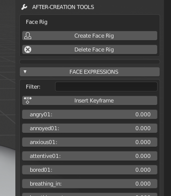

Expressions
===========

.. image:: images/expressions_01.png

When a model is finalized, the after creation tools are enabled. If the user doesn't alter the topology and the shapekeys of the character, the after-creation tool "face expressions" will show a set of intuitive sliders.

This tool is very easy to use: just move the sliders to mix the various expressions.

You can also use the button "Insert keyframe" to insert an animation key at the current frame.

There is also another button at the end of the list, "Reset expression", to reset all expressions to zero value.

Behind this simple usage there is a complex algorithm that translates the linear combination of high level components (for example 0.3*smile + 0.5*grin + 0.1*sad ecc..) to a linear combination of few low level basic elements (x1*mouth01 + x2*mouth02 +x3*eye01, ecc..). This approach fixes in most of cases the problem of "hyper-expressions", that happens very frequently with the direct interpolation of expression shapekeys.
