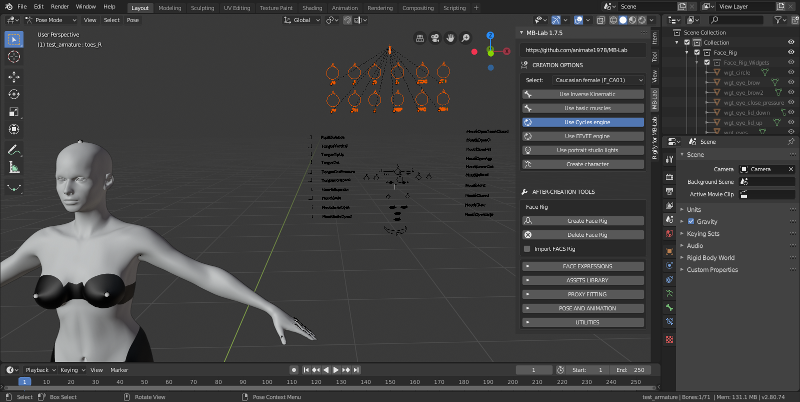

Face Rig
========

The Face Rig is designed to help animate the facial expressions using a custom rig.

This rig controls various expressions of a MB-Lab character by using the controls shown above.

.. image:: images/facerig_GUI.png

To add the rig, just click on the Add Face Rig button for your finalized character.

To delete the rig, you need to select your finalized character first, then click the Delete Face Rig button.

There is a known bug that pops up when you try to delete the rig without having your character selected first, this is being investigated.

The Face Rig also has the option to import the FACS rig, which is an advanced rig for automated lip sync using these other Blender addons.

.. image:: images/FACS_GUI.png

https://github.com/amirpavlo/YASP

https://github.com/amirpavlo/BYASP

