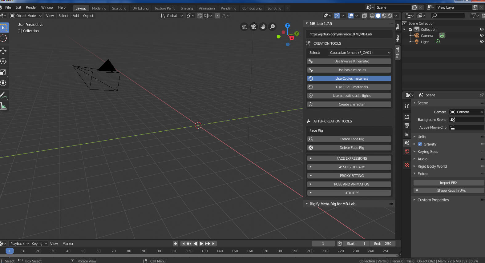
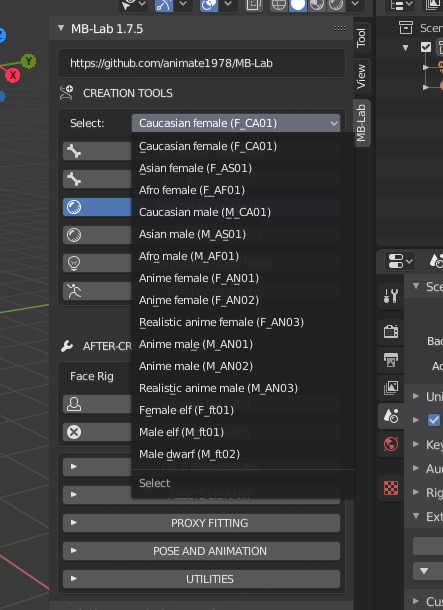
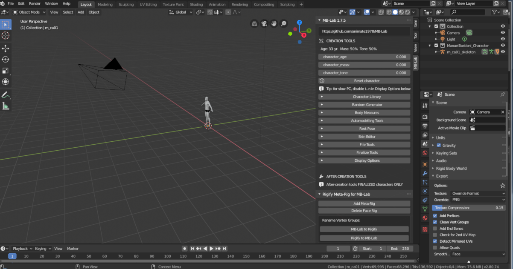
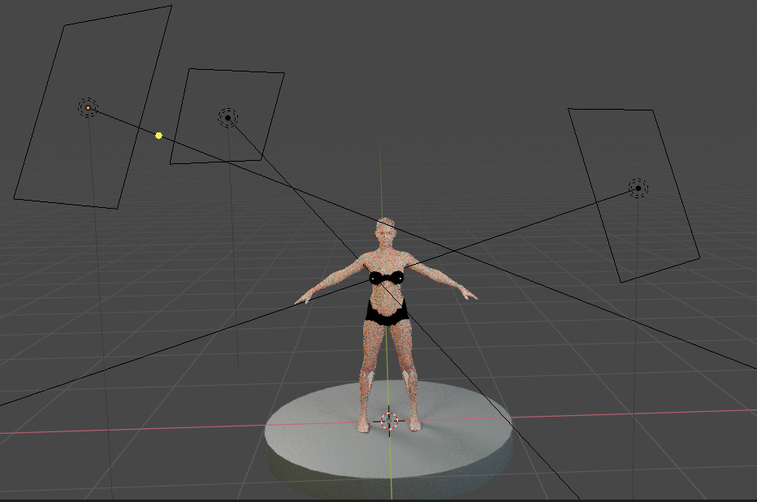

Getting Started
===============

The user interface is perfectly integrated in Blender and designed to make the modeling process a simple and clear process.

At the start the creation section contains only few elements:

* The selector to choose the base model
* The option related to the type of skeleton (basic, with inverse kinematic, with bending muscles)
* The create button to initialize it
* Some options related to rendering engine and lights

.. image:: images/GUI_175.png

MB-Lab includes a set of base characters, as shown in the figure:

Pressing the "create character" button, Blender will create the selected model, placing it in the centre of the scene, at coordinates 0,0,0.

MB-Lab was redesigned for Blender 2.80 and now has shading networks for both Cycles and EEVEE. Choosing either option will also select the render engine required.

The option "Use portrait studio lights" creates a set of lights.

Note: the scale is one BU (Blender Unit) = one meter.

The system has to import some hundreds of morphings, so it requires some time to complete. At the end of the process the character will be ready for modification.

.. toctree::
   :maxdepth: 2

   base_char
