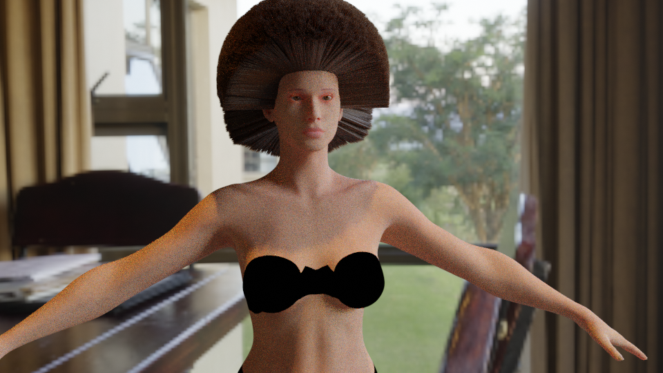
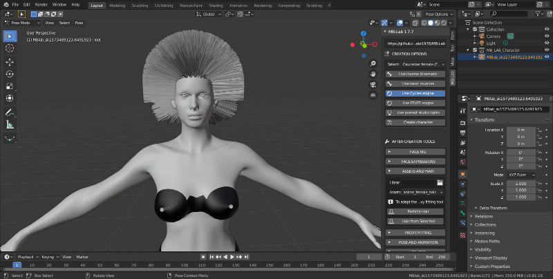
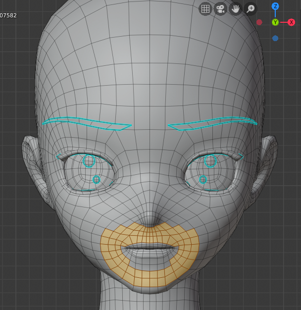
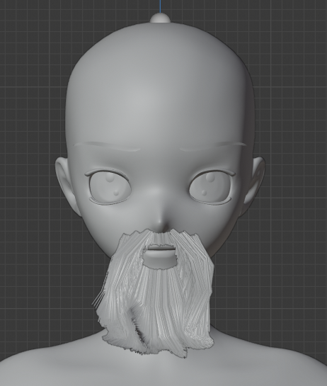

Hair System
===========

The new Hair Engine allows the ability to add particle hair to a MB-Lab character after finalization.

The particle hair can be accessed in ASSETS AND HAIR.

.. image:: images/GUI_hair_01.png

Features

- Add hair from selected polygons.

This adds the ability to create custom hair objects on virtually any part of the body.

- Add unlimited hair objects.

You can add as many particle Hair systems as you want!

===============
How to add Hair
===============

1. Create and FINALIZE the character model. Adding the Hair Engine only works on FINALIZED models, just like the other assets.

2. Click on ASSETS AND HAIR in the MB-Lab GUI

.. image:: images/hair_tutorial_01.png

3. Click on Particle Hair

4. Done!

After this you can groom the particle hair as you please, using the standard Blender tools.

====================================
How to add Hair to Selected Polygons
====================================

This is another feature of the Hair Engine that allows you to add particle hair to selected ploygons of a MB-Lab character.

1. In EDIT mode, select the polygons you want to add Hair to

2. Click on Hair from Selected

.. image:: images/hair_tut02_addselected.png

3. Done!

Again you can groom the hair system using the Blender tools

Add more Hair!

.. image:: images/hair_tut02_004.png

=====
NOTES
=====

The Hair Engine is a brand new feature and is evolving at a fast pace, expect the code to change

Currently there is no shader assigned to the Hair system upon creation, this is actively being worked on and should appear soon.

