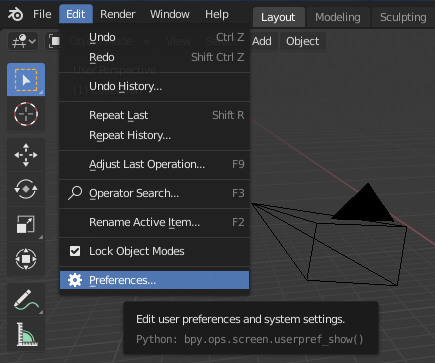
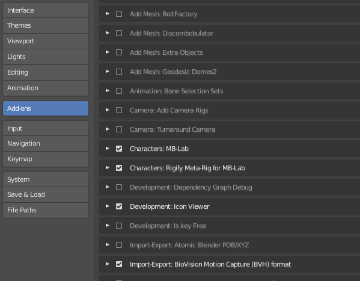
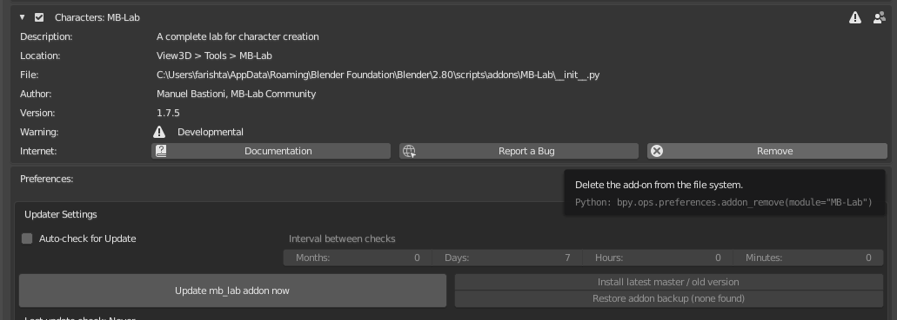

Installation
============

==============
Install MB-Lab
==============

**IMPORTANT**

Because of how Github packages releases, this WILL affect how you install MB-Lab if downloading from the release page ONLY!

If you download a clone where Github renames it **MB-Lab-master**, you will not have issues.

You need to go to that directory and rename it from **MB-Lab 1.x.x** to **MB-Lab-1-x-x** or **MBLAB175** if you want to be simple, **just get rid of the periods in the directory name** and Blender will recognize it and add the addon to the list.

* Step 1

In Blender 2.80, open the user preferences window, choosing Edit → Preferences

* Step 2

Press the "Install" button in the top right side of the window

.. image:: images/install_02.png

* Step 3

Use the file selector window in order to find the zip file, select it and click the button "Install Addon from File".

.. image:: images/install_03.png

* Step 4

When the installation will be completed, a new category named "Characters" will appear in the Categories list. Select it and enable the lab using the check button. When the plugin is enabled, remember to press the button "Save User Settings", in order to load the lab automatically each time you start Blender.

* Step 5

Close the User Preferences window.

Press "N" to make the Sidebar with the MB-Lab interface appear in Blender 2.80

.. image:: images/new_GUI_001.png

================
Uninstall MB-Lab
================

In Blender, open the user preferences window, choosing File → User Preferences

In the addon tab, look for Characters → MB-Lab

Click on "Remove" button

It is VERY important to not have multiple copies of ManuelBastioniLAB or MB-Lab, there will be conflicts! Remove the old version first, then install from file the new version.

=============================
MANUAL INSTALLATION / REMOVAL
=============================

You can manually install MB-Lab as well. You need to unzip MB-Lab to the following directories for your OS.

* Windows 7 - C: \ Users \ USERNAME \ AppData \ Roaming \ Blender Foundation \ Blender \ 2.80 \ scripts \ addons

* Windows 10

* Linux - /home/USERNAME/.config/blender/2.80/scripts/addons/

To remove simply delete the MB-Lab directory from your file system