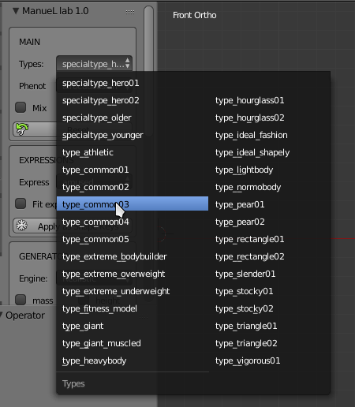

A "type" defines in one shot all the main features of the body: bone
structure, fat percentage, mass and muscles. Each type is created upon
anthropometric data and artistic observations and delineates the body of
the character.

Types are labeled using simple names, like "ideal fashion", "athletic",
"lazy", "hourglass".

The system uses this kind of identifiers because they are less difficult
to remember and more intuitive than scientific terms utilized in
anthropometry.

Types can be selected via the intuitive GUI in the main panel, it's also
possible to use the "Mix" option to blend different types.

A "special-type" differs from the "type" because it can describe
non-realistic creatures (as example comic heroes, brute and other people
with augmented proportions) or data-only entities (for example "older"
and "younger" special types).

Depending on the features that are modified and the way they are
modified, types can be grouped in some big categories:

  - Types defined mainly by the variation of muscle and mass percentages
  - Types defined mainly by the variation of proportions
  - Types defined by basic shapes

Examples of types

