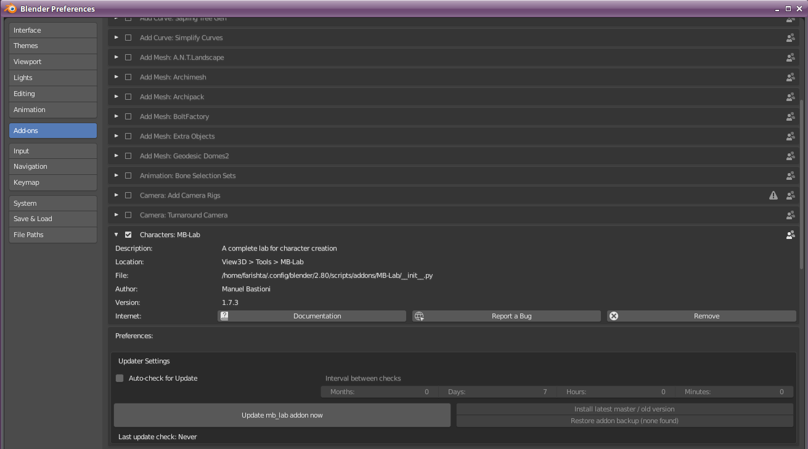

New Features
============

Version 1.7.4

Shaders for this version have been re-worked from the ground up to try to achieve a realistic look as much as possible.

The skin shader has dropped the Principled BSDF node in favor of a new custom node network.

Procedural veins have been added. The visibility of the veins are controlled by a slider in the skin editor.

The eyes have become completely procedural in this version, which allows a greater range of color for the iris than before.

Eye vein visiblity is controlled with a slider.

The lighting setup has been changed to a three point arrangment using Area lights now.

In version 1.7.3 is the addition of the Auto Updater.

This will allow users to update to new versions of MB-Lab without having to go to Github or reclone manually.

The updater can auto check at a user defined set interval.

The updater also can make backups of MB-Lab so if by chance a buggy version is released, this can revert back to working version.

The only downside is that the updater works from version 1.7.3 onward so it is not possible to revert back to previous versions, so this makes it a pretty important update as well.
