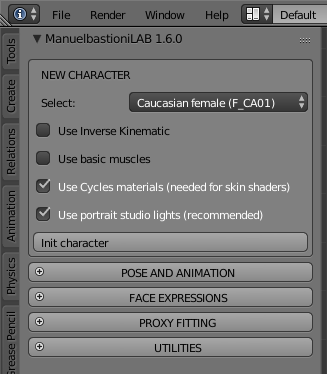

Pose
====

.. image:: images/poses01.png

All characters in MB-Lab are rigged using the same core skeleton structure, in order to have a stable standard and to easily share poses and animations.

The standard skeleton

The core skeleton is designed to be clean and to match most of motion capture files and game engines. The root is located on the floor, and the detailed rigging for toes is merged in one bone.

In lab 1.6 and above, there are two advanced rigging structures built on the core skeleton: the inverse kinematics system and the base muscle system. These two system can be combined, so it's possible to have a character that use both them.

As usual, the GUI to use this technology is very simple: the rigging systems are just options to choose before creating the character.

Starting from version 1.5.0 the standard skeleton also includes eight roll bones

The hand structure is the classic one, with common names for fingers. The hand uses four bones per finger, having posable metacarpus that is very important for some hand positions.

.. image:: images/poses02.png
