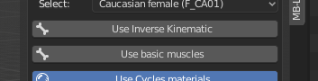
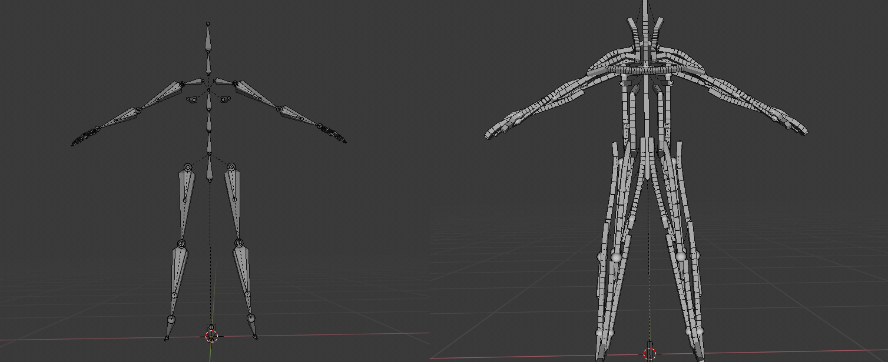
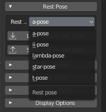
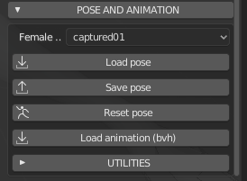
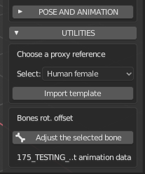

Pose
====

.. image:: images/poses01.png

All characters in MB-Lab are rigged using the same core skeleton structure, in order to have a stable standard and to easily share poses and animations.

The standard skeleton

The core skeleton is designed to be clean and to match most of motion capture files and game engines. The root is located on the floor, and the detailed rigging for toes is merged in one bone.

In **version 1.6.0** and above, there are two advanced rigging structures built on the core skeleton: the inverse kinematics system and the base muscle system. These two system can be combined, so it's possible to have a character that use both them.

As usual, the GUI to use this technology is very simple: the rigging systems are just options to choose before creating the character.

Starting from **version 1.5.0** the standard skeleton also includes eight roll bones

The hand structure is the classic one, with common names for fingers. The hand uses four bones per finger, having posable metacarpus that is very important for some hand positions.

.. image:: images/poses02.png

===============
Rigging Systems
===============

MB-Lab offers several rigging options.

* Base Skeleton
* Base Muscle
* IK Skeleton
* IK Skeleton and Muscle

These options can be selected at MB-Lab start up.

Depending on the rig options selected will determine the resulting rig and ultimatly how the character will be used depending on the needs of the user.

==================
Muscle base system
==================

MB-Lab includes a simulated muscle armature. This system tries to emulate the behaviour of the human muscles

.. image:: images/muscles_175.png

Originally there was a plan of two muscle systems, one which is already included in MB-Lab and another more advanced system, as described by Manuel Bastioni as a more accurate model. One of the main difference between the two systems is that the "full" one will be anatomically more accurate, but it will require (probably) to have the lab installed on the production machine. On the contrary, the "base" system already implemented in **version 1.6.0** and above, that simulates only the main muscles masses, relies on the standard Blender tools and after the finalization step the character will work on any recent version of Blender, with or without the lab installed.

The images show some features of the muscle system and a comparison with the base skeleton system:

To reach this goal, a big amount of time was spent to design a flexible armature using only basic built-in components offered by Blender, without drivers but only constraints. The structure was heavily tested with many benchmark animations, in particular to avoid or minimize the problem of unwanted rotations that sometime are created by the solver for extreme angles. 

==================
Inverse Kinematics
==================

.. image:: images/poses10.png

The IK structure offers a set of additional bones used to control the limbs in an easy and intuitive way.

Inverse kinematic controllers

It includes special controllers for fingers (the complex movement open-close of each finger, obtained as a combination of four bones, is handled by one controller), controllers for metacarpals (one controller handles contemporary the movement of all the metacarpals), controller for heel-toe movement, track target for head, and more.

==========
Rest Poses
==========

.. image:: images/restposes01.png

A rest pose is what you see when there are no poses applied, in other words, when all the limbs rotations are zero.

The rest pose is an important feature because it determines the behaviour of the skeleton during the animation and the posing. For this reason the choice of the rest pose is part of the character "creation" phase.

On the contrary, The action poses and the animation are part of the "after creation" phase. You can read more about the "creation" and "after creation" steps in the modelling process section.

* NOTE: The rest pose selector is not available for skeletons with inverse kinematics.

The GUI is very intuitive. You can select one of the preset rest pose from the builtin library, or load/save a custom rest pose.

.. image:: images/poses_03.png

To load a preset, just select it from the drop-down menu:

The built-in library covers the most common configurations used in CG.

To create a custom rest pose, select the skeleton, enter in Blender "pose mode" and proceed with the usual Blender techniques (RKEY to rotate, etc..). Then use the "Save custom rest pose" button to save the pose as json database. Since all skeletons of MB-Lab are based on the same armature structure, the rest pose can be used with all lab characters. To load a custom rest pose, press the "Load custom rest pose" button and select the pose file.

============
Pose library
============

The pose library is an after creation tool, so it's available only for finalized characters.

.. image:: images/poses_02.png

The GUI for the pose library is very intuitive: The first element is a drop down menu that shows all the artistic poses currently implemented, labeled with intuitive names.

The buttons "Load pose" and "Save pose" are used to load and save poses using a simple json file.

==========
Animations
==========

MB-Lab can load a raw animation from bvh files. It's an advanced expert system that analyzes the "anatomy" of the bvh, automatically recognizes the various elements (fingers, head, spine, feet, ecc.). During the tests it successfully recognized the most common skeleton structures used in mocap descriptions.

The animation system works best with a basic armature, it has been noticed that using the Muscles armature will cause deformation of the body mesh, at this point it is not entirely understood why. It is also not possible to use bvh animation files with the IK rig.

=========
Utilities
=========

In some cases, when the rest pose of the bvh is not perfectly equal to the rest pose of the lab character, it's required to correct the angles of some parts (usually clavicles and upper arms). This can be easily done selecting the bone to correct and using the offset tool under "Utilities" section.

The system is not designed to correct the bvh, but just to load and retarget the animation as it is, so things like wrong angles, tremors, frame rates must be corrected using external specific tools.

Save and load config files to adjust bones after importing BVH animation files.

.. image:: images/bone_offset_01.png

With this feature, you'll be able to tweak XYZ bone rotations, store in a file for a specific BVH Animation ( or more depending on the adjustments ) and then simply load this file whenever you want to reuse that BVH animation and the tweaked bones will self-adjust.