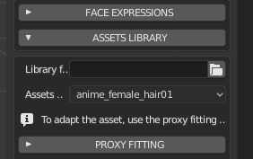
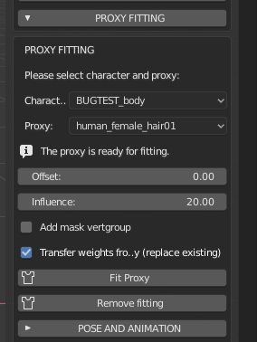
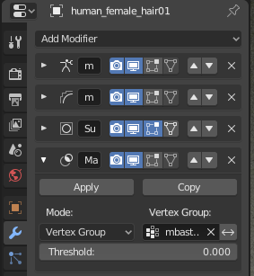

Proxy System
============

.. image:: images/proxy01.png

A "proxy" is a mesh able to fit the character in order to be adapted to its transformations.

The classic case of proxies are the clothes and hair.

.. image:: images/gallery_160_04.png

In MB-Lab, the proxy usage is very simple. Practically it consists just in two steps:

* Prepare the proxy tailored for a base template and save it.
* Load the proxy and use it on any derived character.

A character derived from a base template is a character created modifying the lab parameters of a base model. For example if you create ten characters initiated with the caucasian female base, all them are derived from the caucasian female base.

Continuing with this example, a proxy designed for the caucasian female base will be fitted to the ten characters with one click.

Another important feature is that the fitting algorithm used in the lab automatically takes account of rotations and of rigid pieces. This is fundamental in case of proxies that mix dynamic flexible and rigid fitting, for example boots with high heels.

.. image:: images/proxy03.png

===========
Proxy Usage
===========

The proxy usage consists of two steps:

* Prepare the proxy tailored for a base template and save it.
* Load the proxy and use it on any derived character.

------
Step 1
------

**Prepare the proxy tailored for a base template**

1. Open the "Utilities" in the after-creation section of the lab.

.. image:: images/utilities_01.png

2. Select a base template and load it with the "Import template" button. In this example the caucasian female template was loaded.

.. image:: images/utilities_02.png

3. Import the clothes mesh (or model a new one from scratch). For this tutorial a standard Wavefront obj was imported, but you can use any format and any import technique supported by Blender. The algorithm handles both triangles and quads topologies.

.. image:: images/import_obj_01.png

4. Manually fit the proxy to character, with the usual Blender techniques (scale, rotate, edit of verts, etc). One of the best tool to do this is using the Blender Proportional Edit brush.

.. image:: images/proxy19.png

* Using the proportional edit tool to fit the clothes

NOTE: If you prefer, as alternative way, you can export the base template and fit the proxy upon it using an external software. In this case you can skip steps (3) and (4).

5. Save the proxy model. You can do it in two ways:

A) If you want to load the proxy directly from the assets library, save the tailored cloth as .blend file in your library folder (the folder that you will select in the assets GUI, see "step 2" below), using a filename identical to the proxy object name. For example if the proxy object is named "cloth01", the file must be called "cloth01.blend".

B) If you want to load the proxy using generic Blender functions, like "append" or "import", save it as blend file or exporting it in another 3D format, as you prefer.

6. The proxy is ready. With the lab proxy tools, it will automatically fit all characters created upon the chosen base template (caucasian female, in this example).

------
Step 2
------

**Load the proxy and use it on any derived character**

Scenario: you have a finalized character created with the lab, derived from caucasian female and you want to fit a proxy on it. You have not altered the topology of the character.

The first thing is to load the proxy into the scene.

If you saved it using the method (A) described above, open the "Library assets" panel and select your library folder: the asset will appear in the drop down menu, ready to be loaded with one click.

NOTE: If selecting the assets nothing happens, probably the blend name doesn't match the object name

If you saved it using the method (B) you have to use the blender built-in functions under File menu: import or append, depending the file format you used to store the proxy.

For this example, as benchmark, a very muscular character derived from the caucasian base was loaded. Since the very different shape of surface, it offers an example for all typical problems that can happen during the proxy fitting.

To make the benchmark even more extreme, a proxy with a skirt was used, that's the most difficult case, since there is not a direct relation between body and proxy. Trousers would be simpler since the algorithm can easily recognize what part of the proxy must be linked with the right thigh and what part must be linked with left tight.

Selecting both the proxy object and the character, the "Proxy fitting" section will show the fitting tools: the parameters "Offset" and "Influence", the option "Add mask vertgroup" and the buttons "Fit proxy" and "Remove fitting".

All the proxy tools are explained in this tutorial, anyway they are very intuitive and the basic fitting process in most of cases is very simple:

* Import or append the proxy.
* Select both character and proxy.
* Press the "Fit proxy" button. Done!

.. image:: images/proxy20.png

Only in case of deformations or skin intersection you will need to play with the options and parameters, as explained in the next part of the tutorial.

=====================================================
Dealing with skin intersection and proxy deformations
=====================================================

As said, the benchmark proxy used in this tutorial will show you all the possible problems that can occur during the process. In fact, after the first fitting, it shows a distortion problem in the center of the skirt.

.. image:: images/proxy21.png

It can be solved with the "Influence" parameter, that controls the "magnetic attraction" of the skin. In this example the value was modified from the default 500 to a lower value of 20, and the deformation gone. This parameter works at best when the character is in rest pose (The whole proxy tool is optimized to fit the clothes in rest poses, but it usually works good enough for other poses too).

Now that the deformation is fixed, the benchmark shows another "classic" problem: the surface intersection that created "holes" in the proxy.

.. image:: images/proxy22.png

The proxy system has two tools to handle the problems of skin intersection: the offset parameter and the vertices mask.

The offset is an intuitive parameter that increases the distance between the surface of the skin and the surface of proxy. In this example it was used an offset of 3.72 instead of the default 0.00. Pressing the fit button again with this value we notice that most of intersections gone, but in this hard benchmark case there is still a visible intersection around the breast.

.. image:: images/proxy24.png

The vertices mask is a very powerful tool that solves practically all intersection problems that can't be fixed with the offset. It creates a new verts group "mbastlab_mask" that contains all body vertices that are too close to the proxy. Then it adds a new mask modifier (a standard Blender modifier) to the character stack that hides all vertices in this group.

Pressing "Fit proxy" again, after enabled the "add mask vertgroup" option, will completely fix the holes.

.. image:: images/proxy25.png

If you remove the clothes you will notice that the part of body closer to the proxy is hidden.

.. image:: images/proxy26.png

It's just a non-destructive modifier: you can always enable/disable it, or even edit manually the vertices in the "mbastlab_mask" group, to improve the mask.

=======================
Edit/remove the fitting
=======================

After the fitting process, if you try to enter in edit mode and manually move the proxy vertices, you will notice that they are "locked". This happens because you are trying to edit a basis shapekey.

When a proxy is fitted to the body, the lab creates automatically two shapekeys:

* The "Basis" to store the original shape of the proxy.
* The "mbastlab_proxyfit" to store the current fitted shape of the proxy.

As usual the shapekeys are listed in the Blender property panel, data tab:

.. image:: images/shapekeys_01.png

So, if you want to manually adjust the fitting, you have to select the proxyfit shapekey and then proceed with the regular edit mode.

In case you want to edit the basis key, you have first to remove all the keys, pressing the lab button "Remove fitting". Alternatively you can remove the keys manually directly from the Blender panel, but you have to remember to delete them in this order: first the proxyfit and then the basis.

===================
Creating New Assets
===================

To create a new asset is actually fairly simple procress but certain requirements are needed in order for them to be used in MB-Lab

* Scaled to the MB-Lab Base model

The assets need to be scaled to size with an MB-Lab mesh. Use some of the assets found in the MB-Lab project as reference.

* Named the same in Outliner as well as filename 

This is required in order for the addon to recognize the file. (eg: anime_hair and anime_hair.blend)
