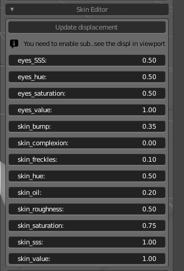

Skin Editor
===========

MB-Lab provides a procedural skin editor that can be used with Cycles or EEVEE.

Behind the simple interface there is a set of complex shaders. These shaders are developed in order to simulate the variety of skin tones and work under any lighting condition:

* An advanced human skin shader
* An advanced toon skin shader
* Shaders for eyes and teeth

=================
Parameters editor
=================

The parameters editor is composed by an intuivive set of sliders for easily modify the values of skin complexion, skin bump, skin oil, skin saturation, skin subsurface scattering and more.
The editor also provides controls for the eyes hue, tone and saturation.

---------------
Skin complexion
---------------

One of most important parameters is the complexion. It modifies the color in order to vary from very light skin to very dark one. It's not just the brightness, but a complex result obtained using the samples from an image included in the lab data.

.. image:: images/gallery_150_13.png

--------
Skin oil
--------

Another important factor is the amount of the oil layer. It's a thin layer that protects the skin, more noticeable in some body parts and almost invisible in others.

---------
Skin bump
---------

This parameter controls the amount of the skin bump. It doesn't affect the true displacement of the subdivided mesh, but only the visual bump effect calculated at render time.

-------------
Skin Freckles
-------------

This parameter controls how much procedural freckles are added

--------------------------
Bump/displacement controls
--------------------------

The button "Update displacement" is the gui for the displacement system, an algorithm that automatically creates the bump map from the values of age, mass and tone parameters.

You should use this button to update the bump/displacement each time you change the meta parameters. Note that to see these changes in realtime, you need to enable some display options.

Each time the button "Update displacement" is pressed, the system recalculates the displacement map using the values of meta parameters. This map can be saved with the "Save displacement image" button, in order to be usable in external engines or in finalized characters.

