Skin Editor
===========

MB-Lab provides a procedural skin editor that can be used with Cycles or EEVEE.

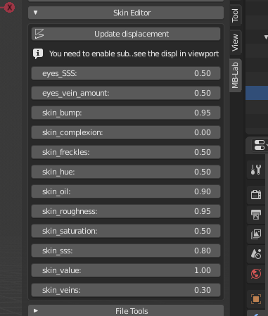

Underneath the Skin Editor is a set of complex surface shaders.

These shaders have been developed to simulate the variety of skin tones and work under any lighting condition. There are currently two sets of shaders, one "photorealistic" set and the "cell" shaders set. Each set of shaders are assigned to specific base models.

* An advanced human skin shader
* An advanced toon skin shader
* Procedural eyeball and iris shaders
* Shaders for the teeth and tongue

The shaders use a combination of texture maps and procedural texture generation, the texture maps are used where procedural generated textures cannot work, while the procedural elements provide details that maps cannot replicate.

.. image:: images/skin_shader_01.png

The following parameter editor will change depending on the base model you choose. The parameters editor is composed by an intuivive set of sliders for easily modify the values of skin complexion, skin bump, skin oil, skin saturation, skin subsurface scattering and more.

===========================
Realistic Shader Parameters
===========================

The realistic skin shader set are part of the realistic base models.

---------------
Skin Complexion
---------------

One of most important parameters is the complexion. It modifies the color in order to vary from very light skin to very dark one. It's not just the brightness, but a complex result obtained using the samples from an image included in the lab data.

.. image:: images/gallery_150_13.png

--------
Skin Oil
--------

This controls the sheen value of the skin oil. The roughness value also affects the visual result of the oil.

.. image:: images/SS_oil_00.png
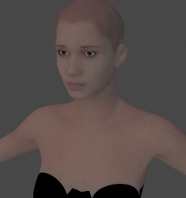

--------------
Skin Roughness
--------------

This controls the micro scale roughness. This value helps control how much skin oil is also visible.

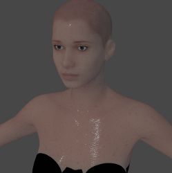
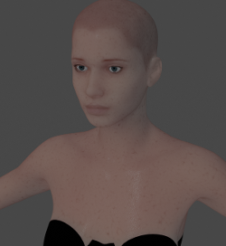

---------
Skin Bump
---------

This parameter controls the amount of the skin bump. It doesn't affect the true displacement of the subdivided mesh, but only the visual bump effect calculated at render time.

.. image:: images/SS_bump_000.png
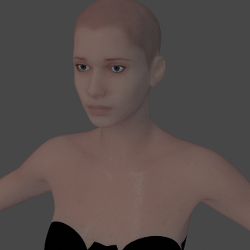

-------------
Skin Freckles
-------------

This parameter controls how much procedural freckles are added, the coverage is affected by a texture mask

.. image:: images/SS_freckles_000.png
.. image:: images/SS_freckles_100.png

----------
Skin Veins
----------

This controls how much procedural veins are added to the skin

.. image:: images/SS_skinveins_000.png
.. image:: images/SS_skinveins_100.png

--------
Skin SSS
--------

This controls the overall Sub Surface Scattering of the skin

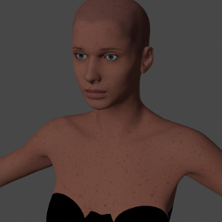
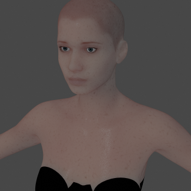

-------
Eye SSS
-------

This controls how much subsurface scattering of the eye is rendered

.. image:: images/SS_eye_sss_000.png
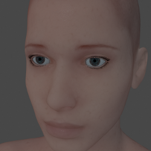

---------------
Eye Vein Amount
---------------

This controls how much veins are visible on the eyeball

.. image:: images/SS_eye_veins_000.png
.. image:: images/SS_eye_veins_100.png

--------------------------
Bump/displacement controls
--------------------------

The button "Update displacement" uses an algorithm to produce a displacement map based on a combination of Age, Mass and Tone.

You should use this button to update the bump/displacement each time you change the meta parameters. Note that to see these changes, "Enable displacement preview" needs to be checked in the Display Options of MB-Lab.

Each time the button "Update displacement" is pressed, the system recalculates the displacement map using the values of meta parameters. This map can be saved with the "Save displacement image" button, in order to be usable in external engines or in finalized characters.

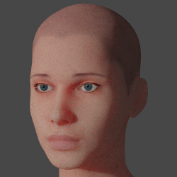
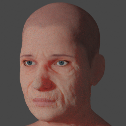

---------
Iris Color
---------

Currently there is no option in MB-Lab to change the iris color in the MB-Lab Skin Editor, this is a feature that is being looked at but for now there is a couple of ways to change the color.

Method 1. Change the color in the Node Editor.

.. image:: images/node_ed_iris_col_01.png

Method 2. Change the color in the Properties Panel.

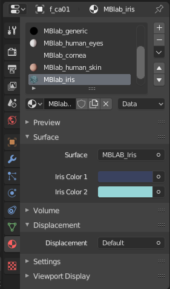

Both ways require a small amount of mouse clicking to get to but the shader has been designed to hopefully make changing the iris color easy as possible with current code.

Also note that the iris is a procedural generated texture that is not quite perfect yet in design so at close up can look a little weird, it is still considered a WIP.

======================
Cell Shader Parameters
======================

The "Cell" shaders have some different sliders for this set.

Be aware that the EEVEE and Cycles rendering will be slightly different due to how the shader works. Also note that this shader is very fast and you will be able to see changes in near real time with EEVEE as well as Cycles.

-------------
Skin Oil Size
-------------

This controls the "oil" size of the cell shader, this effect can bring out the contour of the characters.

.. image:: images/SS_celloilsize_025.png
.. image:: images/SS_celloilsize_085.png

---------------
Skin Oil Value
---------------

This controls the brightness of the "oil", this is used in combination with Skin Oil Size

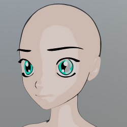
.. image:: images/SS_celloilvalue_100.png

-----------------
Skin Outline Size
-----------------

This controls the thickness of the outline of the characters

.. image:: images/SS_outlinesize_085.png
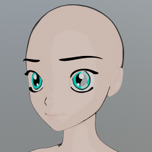

------------------
Skin Outline Value
------------------

This controls how dark the outline will be

.. image:: images/SS_outlinevalue_000.png
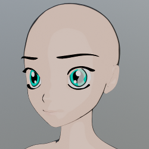

-------------------
Skin Secondary Size
-------------------

This will add another shade to the cell shader, showing even more contour. **This effect is only seen in Cycles currently**

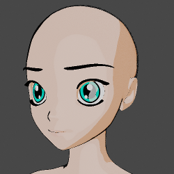
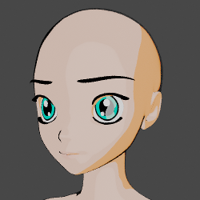

--------------------
Skin Secondary Value
--------------------

This changes the color value of the Secondary cell shading. **Note this is only present in Cycles**

.. image:: images/SS_cellsecval_010.png
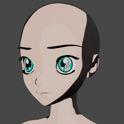

--------
Eyes Hue
--------

This changes the color hue of the iris in the cell shader

---------------
Eyes Reflection
---------------

Controls how much fake reflection is shown on the eyes

---------------
Eyes Saturation
---------------

This controls the saturation of the iris, can be used in combination with Eye Hue to fine tune the color.

----------
Eyes Value
----------

This controls the value, or lightness, of the iris. As with Saturation can be used to fine tune the color of the iris.

===============
Common controls
===============

The skin hue, value and saturation generally work the same in both the Realistic set and Cell set.

--------
Skin Hue
--------

This controls the Hue, or color value in combination with the texture map, making for some interesting shades of skin

----------
Skin Value
----------

This controls the relative lightness of the skin, can be used to fine tune the Skin Complexion

---------------
Skin Saturation
---------------

The controls the relative color saturation of the skin, can be used to help fine tune Skin Complexion

============
Texture Maps
============

There are several texture maps for MB-Lab that provide certain effects to the shaders, such as micro scale roughness, specularity and sub surface scattering.

As with the shaders there are two sets of maps, one for the realistic characters and the other for the anime characters. The "Realistic" set has quite a collection for the various shader effects, while the "Anime" set consists of at this time a single albedo map.

There is also the ability to change these maps, there are several ways to do this. One option is to use MB-Lab to import or export texture maps.

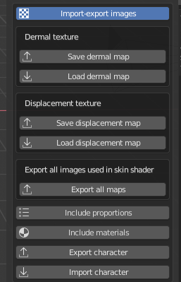

Currently there are only options to export the Albedo map and the Displacement Map (note : for the Anime models there is no Displacement map, so there is not an option to export it), or Export all maps at once, which will include the SSS, specular, roughness and more.

There is also the option to directly change these maps via the Node Editor for the shader you are editing. This is for instance, one of the ways that new maps have been developed, by replacing a shipped texture map with a WIP one.

=======================
Post Finalization Notes
=======================

Once you finalize the MB-Lab character it is NOT required to have the surface shaders currently shipped with, if your production needs differ from the shaders assigned it is fully possible to add your own shaders.

Each base model has shaders assigned to polygons, these shaders can easily be replaced with your own simply by replacing the current ones shipped.

This also applies to the texture maps that are shipped with MB-Lab, these can be edited by your prefered image editor (such as Photoshop or GIMP) to your specfic needs.

============
Future Notes
============

The surface shaders are always undergoing evaluation and testing to try to achieve the best possible visual representation of the human body.

If you have suggestions about the surface shaders please feel free to contact the developers.